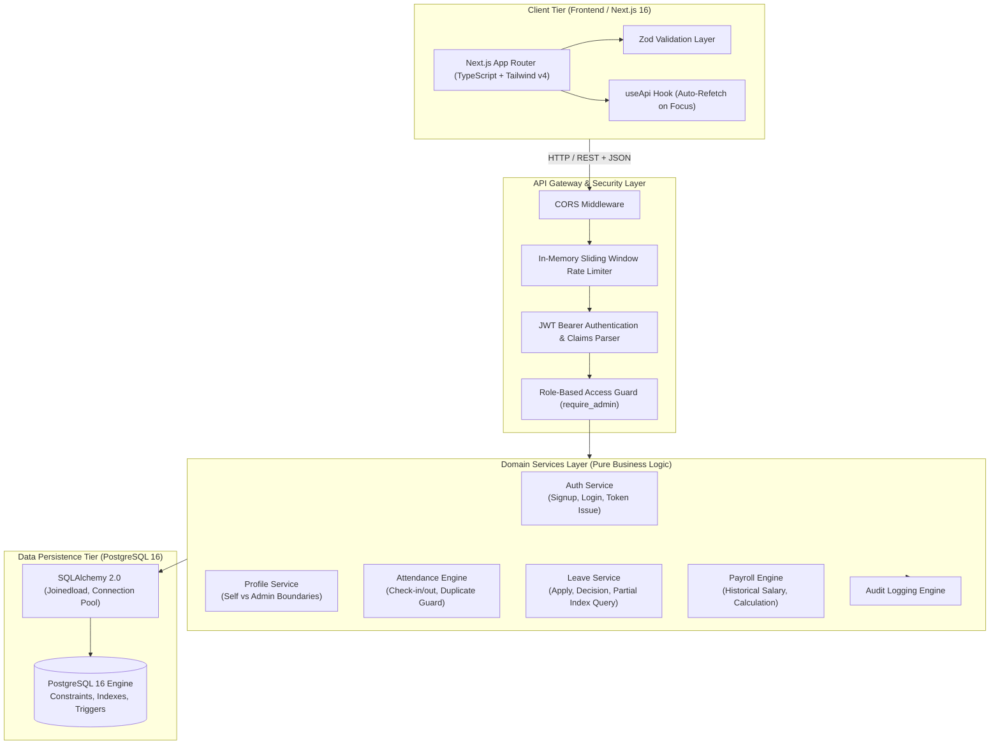
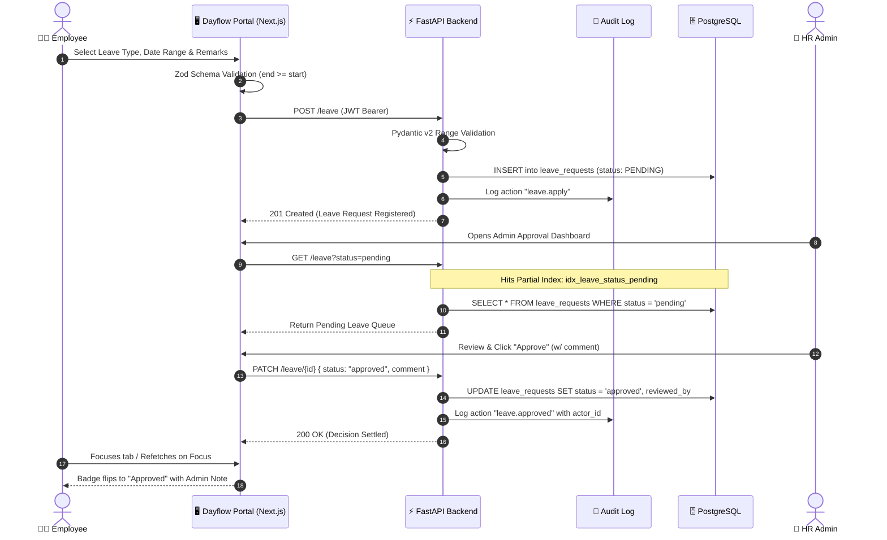
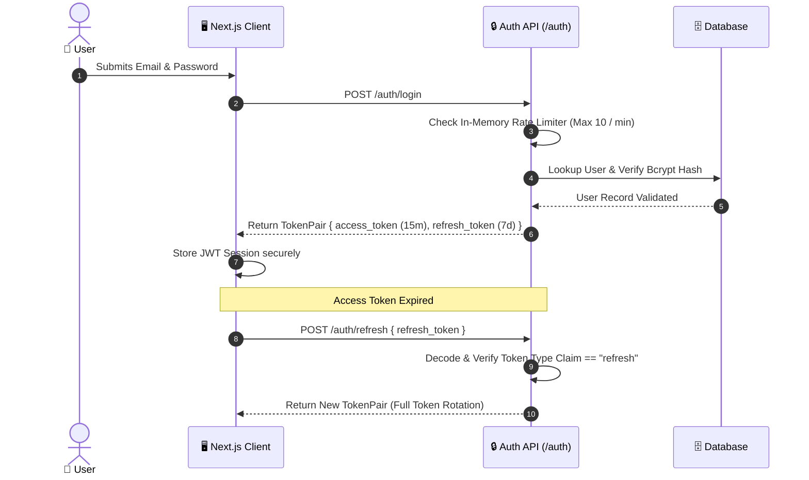
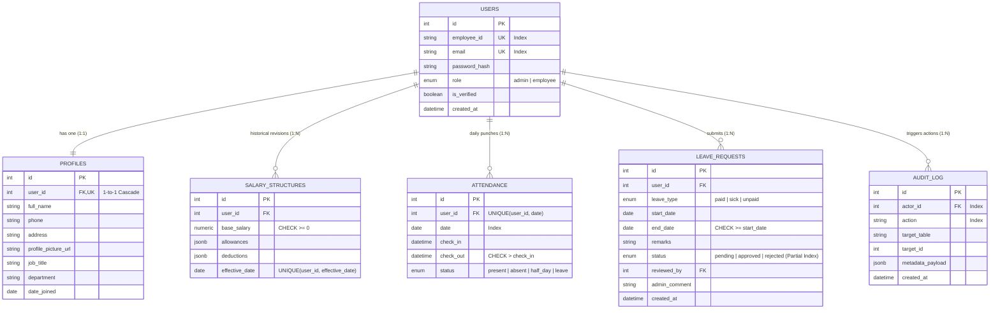

# 🌊 Dayflow — Modern Human Resource Management System

<div align="center">

<p align="center">
  <strong>Every workday, perfectly aligned.</strong>
</p>

<p align="center">
  A high-performance, judging-optimized HRMS designed to unify workforce management, smart attendance tracking, leave lifecycle orchestration, automated payroll processing, and real-time organizational analytics.
</p>

[](https://fastapi.tiangolo.com)
[](https://nextjs.org/)
[](https://www.postgresql.org)
[](https://www.python.org/)
[](https://www.typescriptlang.org/)
[](https://tailwindcss.com/)
[](https://www.docker.com/)

[Judging Criteria](#-judging-criteria-alignment) • [System Architecture](#-system-architecture) • [Three-Layer Validation](#-three-layer-validation-architecture) • [Workflows & Sequence](#-core-workflows) • [Data Model](#-data-model--er-diagram) • [Quickstart](#-getting-started) • [Judge Pitch Hooks](#-judge-talk-tracks-30-second-hooks)

---

</div>

## 🏆 Judging Criteria Alignment

| Criterion | Architectural Decision in Dayflow | How to Verify Live |
|---|---|---|
| **Database Design** | Normalized schema, `UNIQUE(user_id, date)` on attendance, `salary_structures` as a historical audit table (never overwritten), partial indexes, `CHECK` constraints, dedicated `audit_log` table. | Inspect `backend/app/models.py` |
| **Security** | Bcrypt password hashing, JWT with strict `type` claims, server-side RBAC dependencies (`require_admin`), rate limiting on `/auth/login`, parameterized queries (no raw SQL), strict schema boundaries (`extra="forbid"`). | Run `uv run python -m app.security` |
| **Robust Validation** | **Three-layer validation**: Postgres DB Constraints → Pydantic v2 model & cross-field validators → Zod client-side schemas. | Review `backend/app/schemas.py` & `frontend/src/lib/validators.ts` |
| **Modularity & Logic** | Thin route handlers delegating to independent, unit-testable service modules (`app/services/*`). Business logic isolated from HTTP/FastAPI framework. | Inspect `backend/app/services/` |
| **Frontend Design** | Clean neutral palette with single accent color, consistent 8px spacing, color-coded badges, skeleton loaders, and intuitive role-separated navigation. | Run `npm run dev` in `frontend/` |
| **Scalability & Performance** | Stateless JWT architecture (horizontal scaling without session stickiness), pagination on all collections, partial index on pending leave requests (`idx_leave_status_pending`), SQLAlchemy `joinedload` to prevent N+1 queries. | Check partial indexes in `models.py` |
| **Testing & CI/CD** | Automated pytest suite testing against PostgreSQL service container in GitHub Actions (`.github/workflows/ci.yml`), plus pre-push git hook. | Run `uv run pytest` in `backend/` |
| **Debugging & Observability** | Structured JSON logging with `request_id` correlation, global exception handler returning consistent `{detail, code}` payload, fullstack `healthcheck.py` tool. | Run `python3 scripts/healthcheck.py` |

---

## 🏗️ System Architecture

Dayflow is built following a clean layered architecture that separates presentation, API routing, domain business logic, and relational persistence.



---

## 🔒 Three-Layer Validation Architecture

Dayflow enforces input validation across three independent layers that strictly agree with each other:

```
[User Input] 
     │
     ▼
┌───────────────────────────────────────────────────────────┐
│ 1. Frontend Layer (Zod in TypeScript)                     │
│    Instant client-side feedback before network dispatch   │
│    (e.g., end_date >= start_date, password complexity)   │
└────────────────────────────┬──────────────────────────────┘
                             │
                             ▼
┌───────────────────────────────────────────────────────────┐
│ 2. API Layer (Pydantic v2 Models)                         │
│    Schema-level security & cross-field model validators   │
│    (extra="forbid" on profile update, non-negative money)│
└────────────────────────────┬──────────────────────────────┘
                             │
                             ▼
┌───────────────────────────────────────────────────────────┐
│ 3. Database Layer (PostgreSQL 16 Engine)                 │
│    Unbypassable constraints enforced at storage layer:    │
│    - UNIQUE(user_id, date) on attendance                  │
│    - CHECK(end_date >= start_date) on leave requests      │
│    - CHECK(check_out IS NULL OR check_out > check_in)     │
│    - UNIQUE(user_id, effective_date) on salary history    │
└───────────────────────────────────────────────────────────┘
```

---

## 🔄 Core Workflows

### 1. Leave Application & Approval Lifecycle



### 2. Secure Authentication & Token Rotation Flow



---

## 📊 Data Model & ER Diagram



---

## 🚀 Getting Started

### Prerequisites
- Python 3.12+ with `uv`
- Node.js 20+ with `npm`
- Docker & Docker Compose (or local PostgreSQL 16)

### 1. Start Database (One Command)
```bash
docker-compose up -d
```

### 2. Backend Setup
```bash
cd backend
cp .env.example .env
uv sync --all-groups
uv run python -m app.seed       # Seeds demo users, attendance history, and leaves
uv run uvicorn app.main:app --reload --port 8000
```
API Documentation: **http://localhost:8000/docs**

### 3. Frontend Setup
```bash
cd frontend
cp .env.example .env.local
npm install
npm run dev
```
Application URL: **http://localhost:3000**

---

## 👥 Demo Accounts

Password for all accounts: **`dayflow123`** *(One-click login buttons available on the login screen)*.

| Role | Email | Scenario |
|---|---|---|
| **Admin (HR)** | `priya.nair@dayflow.in` | Reviews employee directories, manages payroll, approves/rejects leaves, monitors attendance. |
| **Employee** | `meera.iyer@dayflow.in` | Has **not** checked in today (live "Check In" button), applies for leave. |
| **Employee** | `arjun.rao@dayflow.in` | **Already checked in** today (live "Check Out" button), views salary and attendance history. |
| **Employee** | `rohit.desai@dayflow.in` | Has an approved leave covering today, visible in analytics and calendar. |

---

## 🧪 Testing & Quality Assurance

### Run Unit Tests & Security Self-Check
```bash
# Backend pytest suite (13 tests covering auth, attendance, leave workflow, role boundaries)
cd backend && uv run pytest -v

# Security self-check (validates token typing and password hashing)
cd backend && uv run python -m app.security

# Frontend validation (strict TypeScript check & Next.js production build)
cd frontend && npx tsc --noEmit && npm run build
```

### Full-Stack Automated Health Check
```bash
python3 scripts/healthcheck.py
```
Runs 68 automated checks against the live database, API, RBAC, field boundaries, and the full apply-approve loop end-to-end and outputs a timestamped log to `logs/`.

### Local Pre-Push Git Hook
```bash
cp .githooks/pre-push .git/hooks/pre-push
chmod +x .git/hooks/pre-push
```

---

## 🎤 Judge Talk Tracks (30-Second Hooks)

- **Database Design**: *"Salary is a history table, not an overwrite — every attendance row is DB-constrained to one per user per day, and every leave decision is audit-logged with partial indexes on pending queues."*
- **Security**: *"Role checks happen server-side on every route, refresh tokens live in httpOnly cookies, and passwords are bcrypt-hashed — nothing trusts the frontend."*
- **Validation**: *"Every write passes through three layers — Zod on the frontend, Pydantic on the API, and CHECK constraints in Postgres — so bad data can't get in even if one layer has a bug."*
- **Performance & Scalability**: *"The API is fully stateless — JWT-based, no server sessions — so it scales horizontally behind a load balancer with zero code changes, and queries hit partial indexes to avoid table scans."*
- **Testing & CI**: *"Every push runs the full test suite against a real Postgres service container in GitHub Actions before it can reach main — broken code is structurally blocked from merging."*
